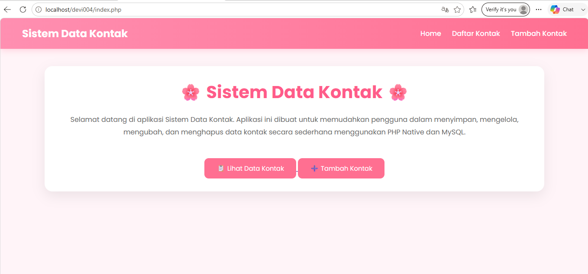
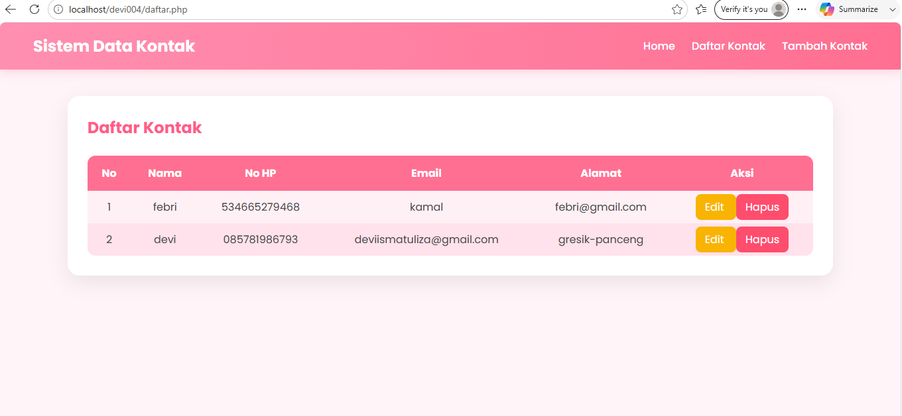
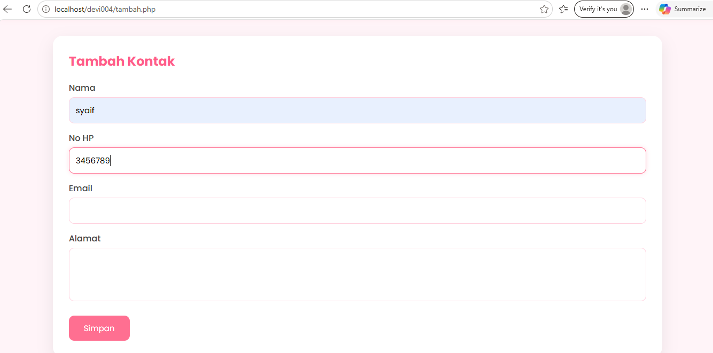
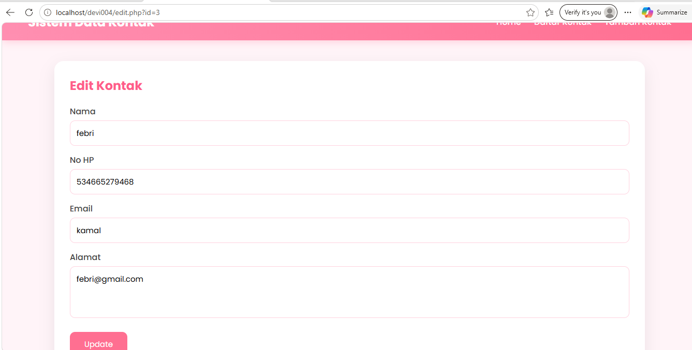

# Sistem Data Kontak

## Nama
Devi Ismatul Izzah

## NIM
240631100004

## Judul
Sistem Data Kontak Berbasis PHP Native dan MySQL

## Deskripsi
Aplikasi Sistem Data Kontak merupakan aplikasi sederhana berbasis web yang digunakan untuk menyimpan data kontak. Aplikasi ini memiliki fitur CRUD (Create, Read, Update, Delete) sehingga pengguna dapat menambah, melihat, mengubah, dan menghapus data kontak.

## Teknologi
- HTML
- CSS3
- PHP Native
- MySQL
- XAMPP

## Struktur Database

Database : data_kontak

Tabel : kontak

| Field | Tipe |
|-------|------|
| id | INT |
| nama | VARCHAR(100) |
| no_hp | VARCHAR(50) |
| email | VARCHAR(100) |
| alamat | TEXT |

## Screenshot

Tambahkan screenshot halaman:
- Home

- Daftar Kontak

- Tambah Kontak

- Edit Kontak


## Cara Menjalankan

1. Jalankan Apache dan MySQL pada XAMPP.
2. Buat database dengan mengimpor file `database.sql`.
3. Simpan project pada folder `htdocs`.
4. Akses melalui:

```
http://localhost/SistemDataKontak
```

## Repository

Project dibuat untuk memenuhi tugas UAS Pemrograman Web.